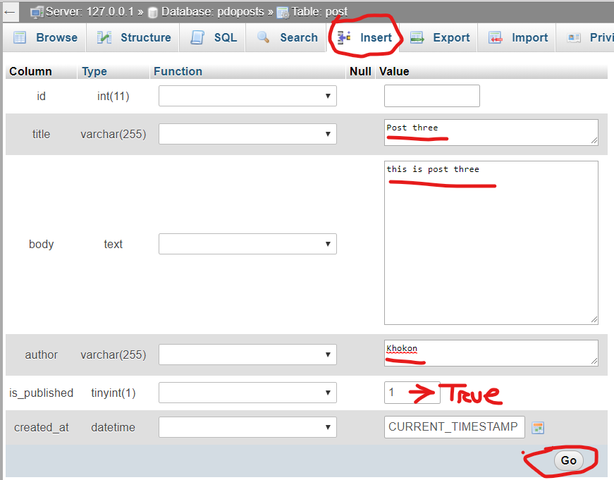

# PDO

[Official docs](https://www.php.net/manual/en/book.pdo.php)
[Youtube Tutorials](https://www.youtube.com/watch?v=kEW6f7Pilc4&t=482s)

[SQL Query from broad tutorial](https://github.com/MdSamsuzzohaShayon/php-sql-uclteam-crud/blob/4_single_record_dlt_finish/MYSQL.md)
[SQL query from w3school](https://www.w3schools.com/sql/);

 - Create a project with **index.php** for output 
 - create a db
 - Create a table
 - from posts create id, A_I, title, body, author, is_published, created_at

 - [Runtime configurations](https://www.php.net/manual/en/pdo.configuration.php)
 - [DB setup in **php** file](https://www.php.net/manual/en/pdo.construct.php)
 - [set pro attribute](https://www.php.net/manual/en/pdo.setattribute.php)
 - [PDO query](https://www.php.net/manual/en/pdo.query.php)
 - [PDO fetch objects](https://php.net/manual/en/pdostatement.fetch.php)
 - [prepare](https://www.php.net/manual/en/pdo.prepare.php)
 - [Prepared statements and stored procedures ](https://www.php.net/manual/en/pdo.prepared-statements.php)
 - Insert few post with all requirement

 - [Dumps information about a variable](https://www.php.net/manual/en/function.var-dump.php);
 - 
