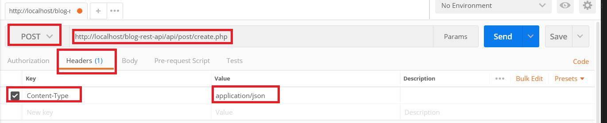
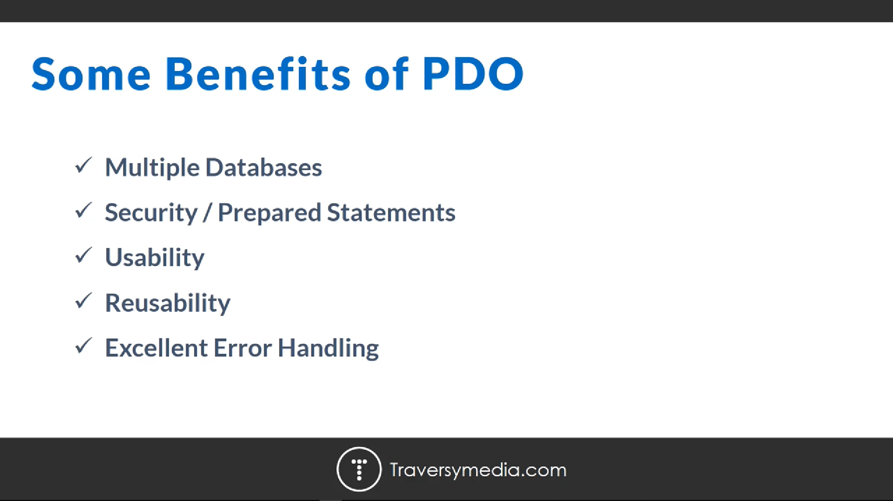
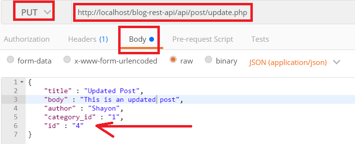
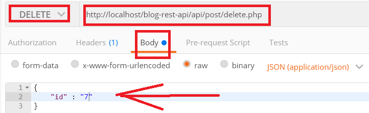

# PHP Rest API

 - [Http headers](https://www.php.net/manual/en/function.header.php)
 - [Http Cors from mdn](https://developer.mozilla.org/en-US/docs/Web/HTTP/Server-Side_Access_Control)
 - Show data with this url from post man make a get request
 - ```http://localhost/blog-rest-api/api/post/read.php```
 - get single post ```http://localhost/blog-rest-api/api/post/read_single.php?id=2```
 - Post though postman

 

 

 - update post

 

 - make a get request with the url below
 ```http://localhost/blog-rest-api/api/post/read_single.php?id=4```

 - delete post

 

 

 - make a get request to ```http://localhost/blog-rest-api/api/category/read.php```

 - make another get req to ```http://localhost/blog-rest-api/api/category/read.php```
